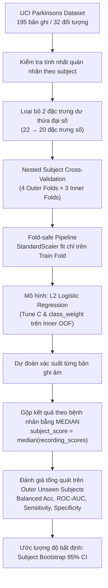

# Parkinson’s Voice Classification: Leakage-Aware Evaluation

> **Subject-Level Classification from Precomputed Voice Features (Leakage-Aware Tabular ML Study)**

[](https://github.com/haminhthong/parkinsons-voice-classification/actions/workflows/ci.yml)
[](https://www.python.org/)
[](https://scikit-learn.org/)
[](https://fastapi.tiangolo.com/)
[](https://streamlit.io/)
[](LICENSE)

---

## 📌 Tổng quan Bài toán & Đóng góp Kỹ thuật

Nhiều dự án Machine Learning trên dữ liệu y sinh dạng bảng mắc phải lỗi nghiêm trọng về **rò rỉ dữ liệu nhóm (group data leakage)**. 

Trong bộ dữ liệu **UCI Parkinsons**:
- Tập dữ liệu gồm **195 bản ghi âm** nhưng chỉ thuộc về **32 đối tượng (subjects)**: 24 người mắc Parkinson (`status=1`) và 8 người nhóm chứng khỏe mạnh (`status=0`).
- Mỗi người thu âm lặp lại từ 6 đến 7 lần nguyên âm kéo dài `/a/`.
- Các bản ghi của cùng một người **không độc lập** (có chung đặc tính âm sắc, cấu trúc thanh quản, thiết bị thu âm).

### ❌ Rủi ro khi chia ngẫu nhiên theo dòng (Record-Level Split)
Nếu áp dụng `train_test_split` ngẫu nhiên theo từng dòng (bản ghi):
```
Bệnh nhân A, Bản ghi 1 ──> Train
Bệnh nhân A, Bản ghi 2 ──> Train
Bệnh nhân A, Bản ghi 3 ──> Test
```
Mô hình sẽ vô tình nhận diện **danh tính giọng nói của bệnh nhân A** thay vì học quy luật tổng quát liên quan đến bệnh lý Parkinson. Kết quả là điểm số đánh giá kiểm thử tăng cao một cách lạc quan giả tạo.

### ✅ Giải pháp: Đánh giá nghiêm ngặt ở cấp độ Bệnh nhân (Subject-Level Split)
Toàn bộ quy trình từ phân chia fold, chuẩn hóa dữ liệu (`StandardScaler`), tìm siêu tham số đến tổng hợp kết quả đều được cô lập triệt để ở cấp độ **bệnh nhân (subject)**. Không một bệnh nhân nào được phép xuất hiện đồng thời ở cả tập huấn luyện và tập kiểm thử.

---

## 🔬 Bằng chứng Thực nghiệm: Naive Split vs. Subject Split

Để chứng minh tác động của rò rỉ dữ liệu, dự án thực hiện thí nghiệm đối chứng trực tiếp:

| Giao thức Đánh giá (Protocol) | Balanced Accuracy | Overlapping Subjects trong Test | Nhận xét & Đánh giá |
| :--- | :---: | :---: | :--- |
| **Random Record Split (Naive)** | **~92.3%** | **24 / 24 subjects (100%)** | ⚠️ **Lạc quan giả tạo**: Toàn bộ đối tượng test đều đã xuất hiện trong tập train. |
| **Nested Subject-Level CV (Leakage-Free)** | **~62.5%** | **0 / 32 subjects (0%)** | ✅ **Ước lượng thực tế**: Bệnh nhân ở test set hoàn toàn mới, phản ánh đúng năng lực tổng quát hóa. |

> *"Row-level evaluation is severely optimistic because repeated measurements leak subject identity into the test set."*

---

## ⚙️ Thiết kế Phương pháp luận (Methodology)



### 1. Tại sao chọn Logistic Regression L2?
Với cỡ mẫu chỉ có **32 bệnh nhân** (trong đó chỉ có 8 controls):
- Các mô hình dung lượng lớn (Deep Neural Networks, XGBoost, LightGBM, CatBoost) hoặc tối ưu hóa hàng trăm thử nghiệm (Optuna) rất dễ rơi vào bẫy **overfit phương pháp luận**.
- Mô hình tuyến tính chuẩn hóa ($L_2$ Regularized Logistic Regression) là lựa chọn khoa học và hợp lý nhất: giúp kiểm soát phương sai và giải thích được trọng số đặc trưng.

### 2. Chuẩn hóa Fold-Safe trong `Pipeline`
Không thực hiện scale toàn bộ dữ liệu trước khi chia fold vì trung bình và phương sai của tập test sẽ bị rò rỉ vào train. `StandardScaler` và `LogisticRegression` được tích hợp trong cùng một `sklearn.pipeline.Pipeline`, đảm bảo scaler chỉ học từ phần train của từng fold.

### 3. Loại bỏ đặc trưng dư thừa đại số (22 → 20 features)
Dự án loại bỏ `Jitter:DDP` và `Shimmer:DDA` vì chúng là bội số xác định của các đặc trưng khác:
- $\text{Jitter:DDP} = 3 \times \text{MDVP:RAP}$
- $\text{Shimmer:DDA} = 3 \times \text{Shimmer:APQ3}$
Đây là xử lý dư thừa đại số tất định (*deterministic redundancy removal*), không phải feature selection bằng mô hình.

### 4. Gộp điểm số theo bệnh nhân bằng Median
Mô hình dự đoán điểm số sàng lọc cho từng bản ghi âm, sau đó gộp điểm theo bệnh nhân:
$$\text{subject\_score} = \text{median}(\text{recording\_scores})$$
**Tại sao chọn Median?** Median ít nhạy cảm với bản ghi âm bất thường (outlier) hoặc lỗi thu âm đột biến so với Mean, giúp ước lượng ổn định hơn ở cấp bệnh nhân.

### 5. Ngưỡng quyết định thống kê (Decision Threshold $\approx 0.42$)
Ngưỡng được chọn bằng cách tối ưu hóa Balanced Accuracy trên dự đoán Out-of-Fold của tập huấn luyện:
> ⚠️ **Lưu ý quan trọng:** Đây là **ngưỡng nghiên cứu nội bộ (internal research threshold)** được tối ưu hóa theo phân bố mẫu, **không phải ngưỡng vận hành lâm sàng (clinical cutoff)**.

---

## 📊 Kết quả Đánh giá Mô hình

### 1. Kết quả Nested Subject-Level CV (4 Outer × 3 Inner Folds)
- **Balanced Accuracy:** **0.625** (Chỉ số chính, phù hợp với tỷ lệ mất cân bằng lớp 3:1)
- **ROC-AUC:** **0.740**
- **Sensitivity (Độ nhạy):** **0.750**
- **Specificity (Độ đặc hiệu):** **0.500**
- **Macro-F1:** **0.614**
- **Brier Score:** **0.215**

### 2. Ước lượng Khoảng Tin Cậy 95% (Subject Cluster Bootstrap)
Nhờ bootstrap ở cấp độ bệnh nhân, ta thấy rõ độ bất định thống kê tự nhiên do kích thước mẫu nhỏ:
- Balanced Accuracy 95% CI: `[0.44 – 0.81]`
- ROC-AUC 95% CI: `[0.55 – 0.90]`

---

## 📁 Cấu trúc Thư mục

```text
parkinsons-voice-classification/
├── README.md                           # Tài liệu tổng quan nghiên cứu
├── MODEL_CARD.md                       # Model card chi tiết
├── pyproject.toml                      # Cấu hình dự án & dependencies
├── Dockerfile                          # Multi-stage Docker build
│
├── data/
│   ├── parkinsons.csv                  # UCI Parkinsons dataset (195 rows, 32 subjects)
│   └── README.md                       # Mô tả nguồn và các cột dữ liệu
│
├── src/
│   └── parkinson_voice/                # Package mã nguồn chính
│       ├── __init__.py
│       ├── data.py                     # Nạp dữ liệu, kiểm tra tính hợp lệ, định danh subject
│       ├── features.py                 # 20 đặc trưng số & Pipeline Logistic L2
│       ├── model_selection.py          # Nested Subject Cross-Validation & Grid Search
│       ├── evaluate.py                 # Metrics, gộp median, threshold search, bootstrap CI
│       ├── train.py                    # Huấn luyện mô hình và lưu artifacts
│       ├── predict.py                  # Nạp mô hình, kiểm tra dải đo, suy luận cấp subject
│       ├── audit.py                    # Audit dữ liệu & demo naive split leakage
│       ├── report.py                   # Xuất 4 biểu đồ trực quan hóa
│       └── utils.py                    # Các hàm tiện ích
│
├── app/
│   ├── api.py                          # FastAPI service: GET /health, POST /predict
│   ├── settings.py                     # Cấu hình đường dẫn artifact và cảnh báo y tế
│   └── streamlit_app.py                # Giao diện Web tương tác nghiên cứu
│
├── reports/
│   └── figures/                        # Biểu đồ phân tích hiệu năng và phân bố điểm
│
├── artifacts/
│   ├── model.joblib                    # Pipeline mô hình đã huấn luyện
│   ├── metrics.json                    # Toàn bộ chỉ số đánh giá thực nghiệm
│   ├── naive_split_audit.json          # Kết quả đối chứng naive split
│   └── evaluation/                     # Chi tiết cross-fitted predictions & fold metrics
│
├── tests/                              # Bộ kiểm thử tự động (pytest)
│   ├── conftest.py
│   ├── test_data.py
│   ├── test_canonical_protocol.py
│   ├── test_evaluation.py
│   ├── test_model_selection.py
│   ├── test_nested_cv.py
│   ├── test_no_group_leakage.py
│   ├── test_prediction.py
│   ├── test_report.py
│   ├── test_reproducibility.py
│   └── test_api.py
│
└── .github/workflows/
    └── ci.yml                          # GitHub Actions CI (Ruff, Pytest, Docker smoke test)
```

---

## 🚀 Hướng dẫn Cài đặt & Sử dụng

### 1. Cài đặt Môi trường
```bash
git clone https://github.com/haminhthong/parkinsons-voice-classification.git
cd parkinsons-voice-classification

# Tạo môi trường ảo
python -m venv .venv

# Kích hoạt môi trường (Windows PowerShell)
.venv\Scripts\Activate.ps1
# Hoặc trên Linux/macOS: source .venv/bin/activate

# Cài đặt thư viện dev & cài đặt package ở chế độ editable
pip install -r requirements-dev.txt
pip install -e .
```

### 2. Huấn luyện Mô hình & Sinh Artifacts
```bash
python -m parkinson_voice.train
python -m parkinson_voice.audit
python -m parkinson_voice.report
```

### 3. Chạy Kiểm thử (Pytest) & Kiểm tra Code (Ruff)
```bash
pytest -v
ruff check .
ruff format --check .
```

### 4. Khởi chạy Ứng dụng Demo

**REST API (FastAPI):**
```bash
uvicorn app.api:app --reload --port 8000
```
- API Health Check: `GET http://localhost:8000/health`
- API Sàng lọc Subject: `POST http://localhost:8000/predict`
- Tài liệu tương tác Swagger UI: `http://localhost:8000/docs`

**Web UI (Streamlit):**
```bash
streamlit run app/streamlit_app.py
```
Giao diện trực quan cho phép tải lên bảng đặc trưng âm học, xem điểm sàng lọc từng bản ghi, điểm median của bệnh nhân và biểu đồ đặc trưng.

### 5. Chạy bằng Docker
```bash
docker build --target api -t parkinson-api .
docker run --rm -p 8000:8000 parkinson-api
```

---

## ⚠️ Tuyên bố Giới hạn & An toàn Y tế (Medical Disclaimer)

1. **Không xử lý âm thanh thô:** Hệ thống nhận các đặc trưng âm học đo đạc sẵn, **không nhận tệp âm thanh trực tiếp (WAV, MP3)**.
2. **Nguyên mẫu nghiên cứu:** Mô hình được xây dựng phục vụ mục đích nghiên cứu phương pháp Machine Learning trên dữ liệu y sinh, **hoàn toàn không phải thiết bị y tế hay công cụ chẩn đoán lâm sàng**.
3. **Bảo mật dữ liệu:** Không tải lên thông tin nhận dạng cá nhân hoặc hồ sơ bệnh án thực tế lên các hệ thống triển khai công cộng.

---

## 📜 Giấy phép

Dự án phát hành dưới giấy phép [MIT License](LICENSE).
