# Patient-Level Parkinson’s Voice Feature Screening

[](https://github.com/haminhthong/parkinsons-voice-classification/actions/workflows/ci.yml)
[](https://www.python.org/)
[](https://numpy.org/)
[](https://pandas.pydata.org/)
[](https://scikit-learn.org/)
[](https://fastapi.tiangolo.com/)
[](https://streamlit.io/)
[](https://www.docker.com/)
[](LICENSE)

> Prototype nghiên cứu cho **sàng lọc đặc trưng giọng nói ở cấp subject**. Mô hình nhận bảng acoustic feature đã trích xuất sẵn; không nhận WAV/MP3 và không dùng để chẩn đoán.

## Bài toán & Phạm vi ứng dụng (Problem & Scope)

Bộ UCI Parkinsons có 195 recording của 32 subject: 24 subject nhãn `status=1` và 8 subject nhãn `status=0`. Nhiều recording thuộc cùng một subject, vì vậy đơn vị độc lập để chia dữ liệu và báo cáo là `subject`, không phải số dòng.

Phạm vi được khóa ở một pipeline duy nhất:

- Input: CSV/JSON gồm `name` và 20 hoặc 22 acoustic features số theo measurement protocol tương thích với UCI Parkinsons. Hệ thống không trích xuất feature từ audio thô.
- Feature contract: kiểm tra 22 feature nguồn, loại `Jitter:DDP` và `Shimmer:DDA` vì dư thừa đại số, còn 20 feature đưa vào model.
- Model: `StandardScaler → L2 LogisticRegression` với chỉ `C` và `class_weight` được chọn trong inner CV.
- Decision: recording chỉ có `screening_score`; score subject là median của các recording; threshold chỉ áp dụng sau aggregation và được chọn từ OOF.
- Output: `model-positive`/`model-negative`, không phải disease probability, chẩn đoán hay chỉ định điều trị.

### Luồng logic, luồng data và pipeline kỹ thuật duy nhất

`configs/default.json` là nguồn cấu hình cho seed, số fold, grid Logistic, metric chính và 5.000 bootstrap replicates. `src/parkinson_voice/train.py`, artifact evaluation, release bundle, report và serving đều phải phản ánh cùng contract này.

```mermaid
flowchart TD
    A["data/parkinsons.csv<br/>195 recordings / 32 subjects"] --> B["load_data + validate_dataframe<br/>schema, numeric, NaN/Inf, binary status, label consistency"]
    B --> C["derive subject_id<br/>bỏ hậu tố recording cuối của name"]
    C --> D["build_data_manifest<br/>checksum, duplicate names/vectors, subject distribution"]
    D --> E["Feature contract<br/>22 source → bỏ DDP và DDA → 20 model features"]
    E --> F["4 outer stratified subject folds<br/>mỗi subject làm outer-test đúng một lần"]
    F --> G["Outer train → 3 inner subject folds<br/>tune chỉ C và class_weight"]
    G --> H["Fold-safe Pipeline<br/>StandardScaler → L2 LogisticRegression"]
    H --> I["recording screening scores<br/>outer-test chưa từng được fit"]
    I --> J["median aggregation theo subject"]
    J --> K["threshold từ outer-train OOF<br/>maximize subject Balanced Accuracy"]
    K --> L["cross-fitted predictions<br/>32 subjects đúng một lần"]
    L --> M["metrics + subject bootstrap 95% CI<br/>5.000 replicates"]
    M --> N["freeze protocol"]
    N --> O["full-data group OOF<br/>chọn deployment threshold/config"]
    O --> P["fit final Logistic trên 195 recordings<br/>tạo release v1.0.0"]
    P --> Q["FastAPI /v1/screen/subject<br/>Streamlit + batch CSV"]
    Q --> R["recording score → median subject score<br/>threshold → research screening result"]
```



Không có recording nào của cùng subject được xuất hiện ở hai phía của một fold. Scaler, model và mọi quyết định threshold chỉ học từ phần train tương ứng. Outer-test chỉ được dùng một lần để đo generalization.

## Hợp đồng dữ liệu và model

| Thành phần | Quy định thực thi |
| --- | --- |
| Dữ liệu huấn luyện | `data/parkinsons.csv`, 195 dòng, 32 subject |
| Cột định danh | `name`; `subject_id` được suy ra, không tin cậy mù giá trị client gửi lên |
| Nhãn train | `status ∈ {0,1}`; bắt buộc nhất quán trong từng subject |
| Feature nguồn | 22 cột acoustic số từ `parkinson_voice.data.ORIGINAL_FEATURES` |
| Feature bị bỏ | `Jitter:DDP`, `Shimmer:DDA` — redundant đại số, không phải chống leakage |
| Feature model | 20 cột trong `parkinson_voice.features.MODEL_FEATURES`, thứ tự exact |
| Model | `StandardScaler` + `LogisticRegression(penalty=l2, solver=liblinear)` |
| Aggregation | `median`, bị khóa trong `parkinson_voice.utils.SUPPORTED_AGGREGATIONS` |
| Threshold | statistical threshold từ subject-level OOF, không phải clinical operating point |
| Reliability | training-range P1–P99 và `INSUFFICIENT_RECORDINGS`; đây là cảnh báo plausibility |

Artifact release nằm tại `artifacts/releases/v1.0.0/` và gồm `model.joblib`, `metadata.json`, `feature_schema.json`, `evaluation.json` và `model_card.md`. `load_bundle()` kiểm tra schema version, exact feature order, model type, aggregation và threshold trước khi inference.

## Cấu trúc thư mục dự án (Project Structure)

```text
.
├── .github/workflows/ci.yml       # lint, test, README/notebook, Docker smoke build
├── app/
│   ├── api.py                      # FastAPI: /health, /ready, /model-info, /v1/screen/subject, /predict
│   ├── settings.py                 # artifact path, upload/row limits, research warning
│   └── streamlit_app.py            # upload feature CSV và hiển thị score subject
├── artifacts/
│   ├── data_manifest.json
│   ├── metrics.json
│   ├── evaluation/                 # cross-fitted predictions, fold metrics, selection, threshold, CI
│   └── releases/v1.0.0/             # versioned deployment bundle và model card
├── configs/default.json             # seed, nested folds, Logistic grid và bootstrap policy
├── data/
│   ├── parkinsons.csv
│   └── README.md
├── notebooks/
│   ├── 02_colab_reproducible.ipynb # notebook tự chứa, chạy đúng package/src và data
│   ├── build_colab_notebook.py
│   └── validate_colab_notebook.py
├── reports/figures/                # bốn hình canonical sinh từ evaluation artifacts
├── scripts/
│   ├── audit_data.py                # dataset integrity + manifest
│   ├── evaluate.py                  # train/evaluate canonical pipeline
│   └── predict.py                   # batch inference bằng release artifact
├── src/
│   └── parkinson_voice/             # package source duy nhất của pipeline
│       ├── data.py                  # load, validate schema, subject identity
│       ├── audit.py                 # manifest và audit leakage minh họa
│       ├── features.py              # fixed 20-feature contract + Logistic pipeline
│       ├── evaluate.py              # subject folds, metrics, aggregation, threshold, bootstrap
│       ├── model_selection.py       # inner search và nested subject CV
│       ├── predict.py               # load bundle, range warning, subject inference
│       ├── train.py                 # canonical training entrypoint
│       ├── report.py                # 4 biểu đồ từ evaluation artifacts
│       └── cli.py                   # entrypoints parkinson-audit/evaluate
├── tests/                           # unit, integration và regression invariants
├── Dockerfile
├── pyproject.toml
├── requirements*.txt
├── MODEL_CARD.md
├── SECURITY.md
└── README.md
```

## Hướng dẫn cài đặt & chạy thử nghiệm

### 1. Tạo môi trường

```bash
git clone https://github.com/haminhthong/parkinsons-voice-classification.git
cd parkinsons-voice-classification
python -m venv .venv
```

Windows:

```powershell
.venv\Scripts\Activate.ps1
python -m pip install -r requirements-dev.txt
python -m pip install -e .
```

Linux/macOS:

```bash
source .venv/bin/activate
python -m pip install -r requirements-dev.txt
python -m pip install -e .
```

### 2. Audit dữ liệu

```bash
python scripts/audit_data.py --data data/parkinsons.csv --artifacts artifacts
```

Audit kiểm tra schema, kiểu số, NaN/Inf, nhãn, label consistency theo subject, duplicate name/vector, phân bố subject và SHA-256. Bản audit leakage record-level trong `src/parkinson_voice/audit.py` chỉ là bằng chứng minh họa rủi ro, không tham gia model selection hay metric production.

### 3. Train và tạo artifact

```bash
python -m parkinson_voice.train --data data/parkinsons.csv --artifacts artifacts
python -m parkinson_voice.report --artifacts artifacts --output reports/figures
python tools/update_readme_results.py
```

Lệnh train ghi `artifacts/metrics.json`, `artifacts/data_manifest.json`, các CSV evaluation và release `v1.0.0`. README chỉ lấy số liệu trong vùng generated marker từ `metrics.json`.

### 4. Chạy test và kiểm tra chất lượng code

```bash
pytest -q
ruff check .
ruff format --check .
python tools/update_readme_results.py --check
python notebooks/build_colab_notebook.py
python notebooks/validate_colab_notebook.py
```

### 5. Chạy API và UI

```bash
uvicorn app.api:app --reload --port 8000
streamlit run app/streamlit_app.py
```

API docs ở `http://localhost:8000/docs`; Streamlit ở `http://localhost:8501`. API tự nạp `artifacts/releases/v1.0.0/model.joblib`.

Batch inference không tạo file phụ nếu không yêu cầu; thêm `--record-output` khi cần lưu score từng recording:

```bash
python scripts/predict.py tests/fixtures/inference_valid.csv \
  --record-output reports/prediction_record_scores.csv
```

### 6. Docker

```bash
docker build --target api -t parkinson-api .
docker run --rm -p 8000:8000 parkinson-api

docker build --target ui -t parkinson-ui .
docker run --rm -p 8501:8501 parkinson-ui
```

API có healthcheck `/health` và readiness endpoint `/ready`. UI có healthcheck `/_stcore/health`.

## Serving contract

### Endpoint canonical: `POST /v1/screen/subject`

Request gồm `subject_id` và một hoặc nhiều recording. Mỗi recording phải có 20 model features; có thể cung cấp đủ 22 source features, trong đó hệ thống tự bổ sung/kiểm tra hai feature dẫn xuất. Không gửi `status`, nhãn bệnh, WAV/MP3 hoặc cột ngoài contract.

```json
{
  "subject_id": "subject_001",
  "recordings": [
    {
      "MDVP:Fo(Hz)": 119.992,
      "MDVP:Fhi(Hz)": 157.302,
      "MDVP:Flo(Hz)": 74.997,
      "MDVP:Jitter(%)": 0.00784,
      "MDVP:Jitter(Abs)": 0.00007,
      "MDVP:RAP": 0.00370,
      "MDVP:PPQ": 0.00554,
      "MDVP:Shimmer": 0.04374,
      "MDVP:Shimmer(dB)": 0.426,
      "Shimmer:APQ3": 0.02182,
      "Shimmer:APQ5": 0.03130,
      "MDVP:APQ": 0.02971,
      "NHR": 0.02211,
      "HNR": 21.033,
      "RPDE": 0.414783,
      "DFA": 0.815285,
      "spread1": -4.813031,
      "spread2": 0.266482,
      "D2": 2.301442,
      "PPE": 0.284654
    }
  ]
}
```

Luồng runtime là: validate request → thêm feature dẫn xuất nếu input chỉ có 20 cột → kiểm tra feature range → tính `screening_score` từng recording → median theo subject → áp dụng threshold → trả reliability và warnings. Recording không bao giờ nhận `predicted_status`.

Các endpoint khác:

- `GET /health`: process đang chạy.
- `GET /ready`: artifact đã sẵn sàng.
- `GET /model-info`: model version, 20 features, aggregation và threshold.
- `POST /predict`: batch CSV/research utility; CSV cần `name` và 20/22 features, không có `status`.

## Kết quả hiện tại

<!-- GENERATED_RESULTS_START -->

### Kết quả nested subject-level evaluation

- **Protocol:** `4 outer × 3 inner`, unit=`subject`
- **Primary metric:** `Balanced Accuracy`
- **Cross-fitted subjects:** `32`; mỗi subject xuất hiện đúng một lần.
- **Pooled Balanced Accuracy:** `0.6250`
- **Pooled Macro-F1:** `0.6135`
- **Pooled ROC-AUC:** `0.7396`

### Deployment contract

- `StandardScaler → L2 Logistic Regression` với `aggregation=median`.
- `C=0.01`, `class_weight=balanced`.
- Full-data group-OOF threshold: `0.4206085668611331`.
- Artifact được fit trên toàn bộ `32` subject sau khi protocol khóa; chưa có external cohort.

<!-- GENERATED_RESULTS_END -->

Các con số trên được đồng bộ bằng `python tools/update_readme_results.py --check`. Bảng chi tiết nằm trong `artifacts/evaluation/`, còn CI bootstrap 95% được lưu tại `artifacts/evaluation/bootstrap_ci.csv`.

## Báo cáo và tái lập

`src/parkinson_voice/report.py` tạo bốn hình từ artifact canonical: `inner_logistic_selection.png`, `cross_fitted_subject_scores.png`, `fixed_feature_contract.png` và `threshold_search.png`. Report chỉ đọc các artifact trong evaluation contract và không tự chọn model khác.

Notebook `02_colab_reproducible.ipynb` nhúng data/config/package `src/parkinson_voice`, chạy audit, nested CV, release fit và inference. `validate_colab_notebook.py` thực thi tuần tự mọi code cell; CI rebuild notebook rồi kiểm tra `git diff` để phát hiện snapshot lệch code.

## CI

Workflow `.github/workflows/ci.yml` chạy trên Python 3.11 cho push và pull request:

1. cài dependency dev;
2. `ruff check` và `ruff format --check`;
3. chạy toàn bộ pytest;
4. kiểm tra README khớp `metrics.json`;
5. build/validate notebook và kiểm tra notebook không bị drift;
6. build Docker API/UI và smoke-test API readiness.

## Giới hạn và an toàn diễn giải

- Chỉ có 32 subject và 8 control; metric và bootstrap CI có phương sai lớn.
- Nested CV là internal unseen-subject evaluation, không phải clinical validation. Chưa có external cohort.
- UCI không có đầy đủ demographic, site, thiết bị và thời điểm ghi âm; không thể kết luận fairness hay domain generalization.
- Feature phải được tạo bởi measurement protocol tương thích UCI. Hai feature có cùng tên nhưng được trích xuất bằng pipeline khác không mặc nhiên tương đương.
- `screening_score` không phải xác suất hiện mắc bệnh trong quần thể và `model-positive` không phải chẩn đoán.
- Joblib chỉ được nạp từ release artifact tin cậy; không cho client upload model.

Chi tiết model card ở [MODEL_CARD.md](MODEL_CARD.md), chính sách an toàn ở [SECURITY.md](SECURITY.md), và thông tin nguồn dữ liệu ở [data/README.md](data/README.md).

## Giấy phép

Mã nguồn dùng MIT License — xem [LICENSE](LICENSE). Dữ liệu UCI có điều khoản nguồn riêng; kiểm tra điều khoản trước khi tái phân phối.
