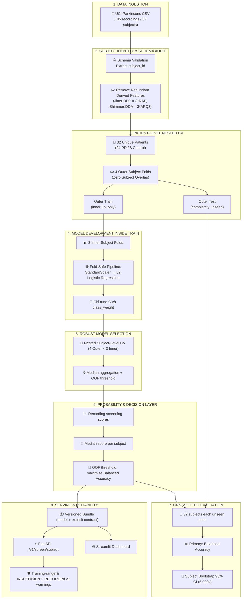

# 🎙️ Patient-Level Parkinson’s Voice Feature Screening

> **Research Prototype:** Hệ thống screening theo subject cho dữ liệu acoustic feature đã trích xuất sẵn. Production v1 khóa pipeline `20 features → StandardScaler → L2 Logistic Regression → recording scores → median subject aggregation → subject decision`.

[](https://github.com/haminhthong/parkinsons-voice-classification/actions/workflows/ci.yml)
[](https://www.python.org/)
[](https://scikit-learn.org/)
[](https://fastapi.tiangolo.com/)
[](https://streamlit.io/)
[](https://www.docker.com/)

---

## 🎯 Điểm Nổi Bật Dành Cho CV / Portfolio

> [!IMPORTANT]
> **Phạm vi đầu vào & Định vị sản phẩm:**
> - Hệ thống hiện **chỉ tiếp nhận bảng 22 đặc trưng âm học số** đã được trích xuất sẵn từ nguyên âm kéo dài `/a/` (theo schema UCI Parkinsons).
> - Hệ thống **KHÔNG nhận file âm thanh thô (WAV, MP3)** và không tự động xử lý tín hiệu âm thanh thô. Vì vậy, dự án được định vị chính xác là **Parkinson’s Voice Feature Screening Prototype**, chưa phải hệ thống phân tích giọng nói end-to-end.
> - Kết quả đầu ra là **cờ sàng lọc nghiên cứu** (`screening_score`, `model-positive`, `model-negative`), **hoàn toàn không phải kết luận chẩn đoán y khoa**.

- **Patient-Level Zero Leakage:** Outer và inner CV đều chia theo `subject_id`; một subject chỉ xuất hiện ở đúng một validation fold.
- **Canonical Evaluation:** Nested 4 outer × 3 inner subject CV trên đủ 32 subject; threshold chỉ chọn từ OOF của outer-train.
- **Honest Generalization:** Primary metric là Balanced Accuracy; Macro-F1, sensitivity, specificity, ROC-AUC, Brier, ECE và bootstrap CI là metric phụ.
- **Fixed Decision Layer:** Aggregation luôn là `median`; recording chỉ có `screening_score`, quyết định chỉ tạo sau khi gộp theo subject.
- **Serving Guardrails:** Training-range warning, `INSUFFICIENT_RECORDINGS`, fail-fast feature schema và API canonical `/v1/screen/subject`.

---

## 🏥 Ranh Giới Lâm Sàng (Clinical Boundary & Intended Use)

- **Mục đích sử dụng (Intended Use):** Phục vụ mục đích học thuật, nghiên cứu phương pháp luận kiểm toán rò rỉ dữ liệu (data leakage audit) trên dữ liệu y sinh dạng bảng có cấu trúc nhóm.
- **Không phục vụ chẩn đoán (Not for Diagnosis):** Mô hình không phải thiết bị y tế (medical device), không được chứng nhận FDA/CE-MDR và không được sử dụng để đưa ra chỉ định điều trị hoặc thay thế khám chuyên khoa thần kinh.
- **Chuẩn hóa thuật ngữ:**
  - Hệ thống xuất `model-positive`/`model-negative` ở cấp subject và `screening_score`; đây không phải disease probability hay chẩn đoán.

---

## 📖 Câu Chuyện Audit: Cạm Bẫy Rò Rỉ Bản Ghi (The 92.31% Leakage Trap)

### 🔴 Tại sao đánh giá ngây thơ (Naive Split) đạt 92.31% nhưng gây hiểu nhầm?
Bộ dữ liệu [UCI Parkinsons](https://archive.ics.uci.edu/dataset/174/parkinsons) gồm 195 bản ghi âm từ **32 bệnh nhân** (mỗi bệnh nhân có 6–7 lần phát âm nguyên âm `/a/`).

> [!WARNING]
> Phần này chỉ là thí nghiệm audit minh họa trong `src/audit.py`. Random Forest và record-level split không thuộc production v1, không dùng để chọn model hoặc báo cáo khả năng tổng quát hóa.

Khi sử dụng hàm `train_test_split` ngẫu nhiên thông thường trên từng dòng bản ghi:
1. Mô hình Random Forest (`test_size=0.2`, `random_state=42`) dễ dàng đạt Accuracy **92.31%**.
2. **Bản chất của audit (`src/audit.py`):** Kiểm tra đối chiếu phát hiện **24/24 bệnh nhân (100%) trong tập test đều đã xuất hiện trong tập train** qua các bản ghi âm khác.
3. **Hậu quả:** Mô hình ghi nhớ đặc trưng âm học riêng biệt của từng cá nhân (speaker acoustic identity) thay vì học các đặc trưng bệnh lý Parkinson tổng quát. Khi gặp bệnh nhân hoàn toàn mới ngoài đời thực, mô hình sẽ suy giảm hiệu năng nghiêm trọng.

```
❌ Naive Record Split (LEAKAGE):
Patient A ──┬── recording 1 ──> [TRAIN]
            ├── recording 2 ──> [TEST]  <-- Rò rỉ danh tính người nói!
            └── recording 3 ──> [TRAIN]

✅ Patient-Level Split (ZERO LEAKAGE):
Patient A ──┬── recording 1 ┐
            ├── recording 2 ├──> [TRAIN ONLY] (Toàn bộ bản ghi của A ở Train)
            └── recording 3 ┘
Patient B ──┬── recording 1 ┐
            ├── recording 2 ├──> [OUTER-TEST ONLY] (Chưa từng xuất hiện ở Train)
            └── recording 3 ┘
```

---

## 🏗️ Kiến Trúc Canonical (Patient-Level Pipeline)

Toàn bộ repository tuân thủ luồng audit → nested evaluation → deployment fit → serving:



---

## 🔬 Dữ Liệu & Kiểm Toán Đặc Trưng (Dataset & Feature Audit)

- **Bộ dữ liệu:** UCI Parkinsons gồm 195 bản ghi âm đo đạc từ 32 cá nhân (24 người bệnh Parkinson, 8 người đối chứng khỏe mạnh).
- **Loại bỏ đặc trưng dẫn xuất dư thừa toán học:**
  - `Jitter:DDP` $= 3 \times \text{MDVP:RAP}$
  - `Shimmer:DDA` $= 3 \times \text{Shimmer:APQ3}$
  - **Lưu ý kỹ thuật P0:** Hai đặc trưng này bị loại bỏ vì có **quan hệ đại số tất định** làm nhân đôi trọng số thông tin một cách không cần thiết, **không phải do data leakage**. Sau khi lọc, còn 20 đặc trưng số độc lập đưa vào huấn luyện.

---

## ⚖️ Giao Thức Đánh Giá Canonical

Để tránh nhầm lẫn giữa các bảng metric, quy trình đánh giá được phân định thành 3 tầng độc lập:

1. **Inner model search:** Chỉ thử `C` và `class_weight` của Logistic Regression trên 3 inner subject folds.
2. **Nested subject CV:** 4 outer folds trên toàn bộ 32 subject. Mỗi subject là outer-test đúng một lần; threshold được chọn trong outer-train OOF.
3. **Deployment fit:** Sau đánh giá, chọn cấu hình frozen và fit trên đủ 32 subject để tạo artifact. Bước này không tạo thêm independent test.

Không gọi 8 subject holdout cũ là clinical validation. Nếu có external cohort, cohort đó mới là final test độc lập.

---

<!-- GENERATED_RESULTS_START -->

### Kết quả nested subject-level evaluation

- **Protocol:** `4 outer × 3 inner`, unit=`subject`
- **Primary metric:** `Balanced Accuracy`
- **Cross-fitted subjects:** `32`; mỗi subject xuất hiện đúng một lần.
- **Pooled Balanced Accuracy:** `0.6250`
- **Pooled Macro-F1:** `0.6135`
- **Pooled ROC-AUC:** `0.7396`

### Deployment contract

- `StandardScaler → L2 Logistic Regression` với `aggregation=median`.
- `C=0.01`, `class_weight=balanced`.
- Full-data group-OOF threshold: `0.4206085668611331`.
- Artifact được fit trên toàn bộ 32 subject sau khi protocol khóa; chưa có external cohort.

<!-- GENERATED_RESULTS_END -->

---

## 📈 Biểu Đồ Trực Quan Hóa Báo Cáo

Các biểu đồ bên dưới được sinh tự động bởi module `src/report.py` và lưu trữ trong `reports/figures/`:

<p align="center">
  
  
</p>

<p align="center">
  
  
</p>

---

## 🔍 Feature Contract Cố Định

Production không chạy `SelectKBest` hay feature selection theo fold. Contract được khóa minh bạch:

- 22 cột acoustic gốc được kiểm tra schema ở đầu vào.
- Loại đúng 2 cột dư thừa đại số: `Jitter:DDP` và `Shimmer:DDA`.
- 20 cột còn lại đi qua `StandardScaler` rồi vào L2 Logistic Regression.
- Danh sách feature, quy tắc tạo `subject_id` và checksum dataset được lưu trong `feature_schema.json` và `data_manifest.json`.

> [!NOTE]
> **Lưu ý:** Hai cột bị loại là dư thừa toán học, không phải bằng chứng data leakage hay kết luận nhân quả sinh học.

---

## 🛡️ Kiến Trúc Phục Vụ Suy Luận (Serving & Guardrails)

Hệ thống serving cung cấp 2 phương thức giao tiếp REST API qua FastAPI:

```
                  ┌──────────────────────────────────────────────┐
                  │ POST /predict (CSV) or /predict/subject (JSON)│
                  └──────────────────────┬───────────────────────┘
                                         │
                              Pydantic Schema Validation
                              (Chặn nhãn status, extra="forbid")
                                         │
                                         ▼
                  ┌──────────────────────────────────────────────┐
                  │ Runtime Reliability & Training-Range Checks   │
                  │ 1. Giá trị ngoài dải P1-P99 tập train?       │
                  │ 2. Ít recording hơn training minimum?        │
                  └──────────────────────┬───────────────────────┘
                                         │
                                         ▼
                  ┌──────────────────────────────────────────────┐
                  │ Recording Inference & Median Aggregation     │
                  │ Logistic Regression + Median + OOF Threshold │
                  └──────────────────────┬───────────────────────┘
                                         │
                                         ▼
                  ┌──────────────────────────────────────────────┐
                  │ Response JSON                                │
                  │ subject_screening_score, screening_result,   │
                  │ reliability ("standard" | "limited"),        │
                  │ warnings: ["INSUFFICIENT_RECORDINGS", ...]    │
                  └──────────────────────────────────────────────┘
```

### 1. Endpoint JSON canonical: `POST /v1/screen/subject`
Yêu cầu mẫu:
```bash
curl -X POST "http://localhost:8000/v1/screen/subject" \
     -H "Content-Type: application/json" \
     -d '{
       "subject_id": "patient_101",
       "recordings": [
         {
           "MDVP:Fo(Hz)": 119.992,
           "MDVP:Fhi(Hz)": 157.302,
           "MDVP:Flo(Hz)": 74.997,
           "MDVP:Jitter(%)": 0.00784,
           "MDVP:Jitter(Abs)": 0.00007,
           "MDVP:RAP": 0.00370,
           "MDVP:PPQ": 0.00554,
           "MDVP:Shimmer": 0.04374,
           "MDVP:Shimmer(dB)": 0.426,
           "Shimmer:APQ3": 0.02182,
           "Shimmer:APQ5": 0.03130,
           "MDVP:APQ": 0.02971,
           "NHR": 0.02211,
           "HNR": 21.033,
           "RPDE": 0.414783,
           "DFA": 0.815285,
           "spread1": -4.813031,
           "spread2": 0.266482,
           "D2": 2.301442,
           "PPE": 0.284654
         }
       ]
     }'
```

Phản hồi mẫu:
```json
{
  "warning": "KẾT QUẢ NGHIÊN CỨU: Mô hình phân loại giọng nói Parkinson là bản thử nghiệm học thuật, không dùng để chẩn đoán, điều trị hay thay thế bác sĩ.",
  "model": "Logistic Regression",
  "model_version": "1.0.0",
  "subject_id": "patient_101",
  "screening_score": 0.814,
  "screening_result": "model-positive",
  "reliability": "limited",
  "warnings": [
    "INSUFFICIENT_RECORDINGS: subject có 1 recording; training minimum là 6"
  ],
  "aggregation": "median",
  "decision_threshold": 0.75,
  "n_recordings": 1,
  "recording_scores": [0.814]
}
```

### 2. Endpoint tải lên file CSV: `POST /predict`
```bash
curl -X POST "http://localhost:8000/predict" -F "file=@path/to/unlabeled_features.csv"
```

CSV gửi vào API không được chứa cột `status`; endpoint này chỉ là tiện ích batch,
còn luồng canonical dùng `POST /v1/screen/subject` để trả kết quả ở cấp subject.

Các endpoint metadata: `GET /health`, `GET /ready`, `GET /model-info`. CSV serving
là batch/research utility; endpoint subject canonical là `/v1/screen/subject`.

---

## 🚀 Hướng Dẫn Cài Đặt & Chạy Thử Nghiệm

### 1. Khởi tạo môi trường ảo
```bash
git clone https://github.com/haminhthong/parkinsons-voice-classification.git
cd parkinsons-voice-classification

python -m venv .venv
# Kích hoạt trên Windows:
.venv\Scripts\activate
# Kích hoạt trên Linux/macOS:
source .venv/bin/activate

pip install -r requirements.txt
```

### 2. Huấn luyện toàn bộ pipeline & sinh artifact
```bash
python -m src.train --data data/parkinsons.csv --artifacts artifacts
python -m src.report --artifacts artifacts --output reports/figures
```

### 3. Khởi chạy ứng dụng Web Demo (Streamlit)
```bash
streamlit run app/streamlit_app.py
```
*Truy cập tại: `http://localhost:8501`*

### 4. Khởi chạy REST API Server (FastAPI)
```bash
uvicorn app.api:app --reload --port 8000
```
*Tài liệu Swagger API tại: `http://localhost:8000/docs`*

### 5. Chạy toàn bộ kiểm thử tự động (Unit Tests)
```bash
python -m pytest
```

---

## ⚠️ Giới Hạn Nghiên Cứu & Nợ Kỹ Thuật (Limitations)

1. **Cỡ mẫu nhỏ (32 bệnh nhân):** Chỉ có 8 đối chứng khỏe mạnh trong toàn bộ tập dữ liệu, dẫn đến phương sai ước lượng lớn.
2. **Chưa có external cohort:** Nested 4×3 CV và bootstrap trên 32 cross-fitted subject là bằng chứng internal; không được gọi là clinical validation.
3. **Thiếu biến số nhân khẩu học:** Dữ liệu UCI không chứa tuổi (age), giới tính sinh học (sex), thiết bị thu âm và bệnh viện thu thập, do đó không thể phân tích độ ổn định theo nhóm nhân khẩu học.
4. **Định dạng lưu trữ Joblib:** Joblib phù hợp với môi trường portfolio cá nhân; trong môi trường production bảo mật cao, cần chuyển sang format an toàn như `skops` hoặc `ONNX` để ngăn rủi ro thực thi mã tùy ý.

---

## 🗺️ Lộ Trình Phát Triển Tương Lai (Future Roadmap)

### P1 / P2: Mở rộng xử lý Audio thô (Raw-Audio Pipeline)
- Tích hợp các tập dữ liệu giọng nói thô có cấp phép (như PC-GITA, mPower, Italian Parkinson's Speech).
- Xây dựng quy trình:
  $$\text{Raw WAV} \xrightarrow{\text{Audio QC + VAD}} \text{Voice Activity Detection} \xrightarrow{\text{Praat / librosa}} \text{Acoustic Extraction (F0, Jitter, MFCC)} \xrightarrow{\text{Classifier}}$$
- Thử nghiệm các kiến trúc Self-Supervised Speech Embeddings tiền huấn luyện: `wav2vec 2.0`, `HuBERT`, `WavLM`.
- **Bất biến cốt lõi (Core Invariant):** Mọi thí nghiệm âm thanh thô đều phải bảo toàn nguyên tắc **phân chia độc lập theo cấp bệnh nhân (Patient-Level Split)**.

### P2 / P3: Kiểm định ngoại viện (External Multi-Site Validation)
- Đánh giá mô hình huấn luyện trên cohort A đối với cohort B nhằm kiểm tra độ dịch chuyển phân phối (domain shift).
- Nghiên cứu độ ổn định của các đặc trưng âm học trước sự thay đổi của micro thu âm và môi trường tạp âm phòng khám.

---

## 📜 Giấy Phép & Miễn Trừ Trách Nhiệm

- **Giấy phép mã nguồn:** MIT License - xem tệp [LICENSE](LICENSE).
- **Tuyên bố y tế:** Dự án này là công trình nghiên cứu học máy mang tính học thuật. Phần mềm không phải là thiết bị y tế và không được dùng để thay thế cho chẩn đoán hay lời khuyên của chuyên gia y tế.
